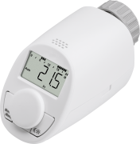
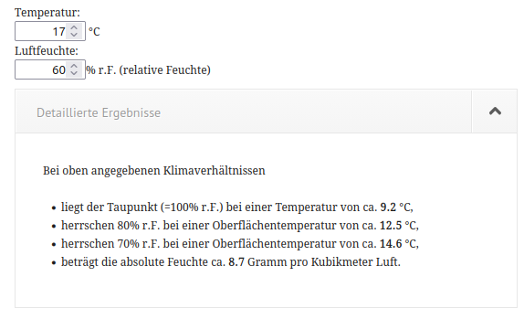
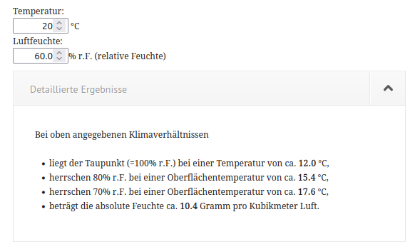
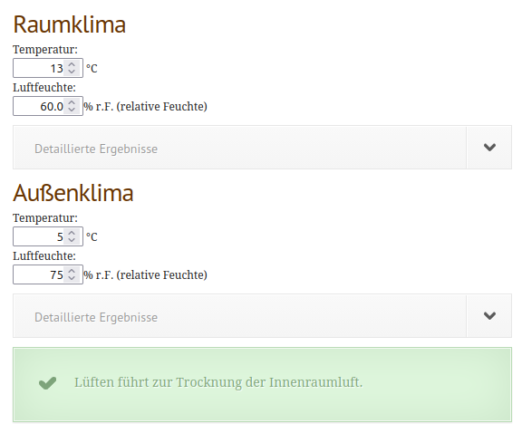

## Weniger Abhängigkeit von überregionalen Energieträgern (Öl und Gas)

- Bestandsgebäude haben oft schlechte, thermische Isolationswerte.
- Daraus resultieren hohe Heizkosten. Die [durchschnittlichen Heizkosten für eine 70 qm Wohnung betragen pro Jahr ca. 1000 Euro](https://www.heizspiegel.de/heizkosten-pruefen/heizspiegel/).
- Ein Heizungstausch ist oft nicht sinnvoll (hohe Kosten, der Energieverbrauch würde nicht sinken, nur der Energieträger würde sich ändern).

## Einsparpotenzial

- Heizkörperthermostate mit Temperaturregelung können den Energieverbrauch um bis zu 30% reduzieren.
- Einmalige Kosten pro Heizkörperthermostat mit Temperaturregelung liegen bei ca. 10 - 20 Euro (bei einer 70qm Wohnung einmalig max. ca. 80 Euro).
- Kosteneinsparung pro Jahr bei einer 70qm Wohnung bis zu 300 Euro pro Winter.

## Funktionalitäten

Folgende Funktionalitäten sollte der eingesetzte Heizkörperthermostat mindestens haben:

- Programmierbarkeit von Zeitfenstern für bis zu 3 Warmphasen (morgens, mittags, abends, oberer Zieltemperaturregelwert) und verbleibenden Kaltphasen (unterer Zieltemperaturregelwert) für alle Wochentage.
- Frostschutz-Automatik
- Verkalkungsschutz-Automatik

## Programmierung von Zeitfenstern für Warm- und kaltphasen

- Zeitfenster sollten für jeden Raum individuell programmiert werden.
- Die Türen von Räumen sollten nur geöffnet werden, um den Raum zu betreten oder zu verlassen.
- Warmphasen sollten sich daran orientieren, wann man sich regelmäßig in einzelnen Räumen aufhält.
- Warmphasen sollten so kurz wie möglich sein.
- Kaltphasen sollten so lange wie möglich sein.
- Der obere Zieltemperaturregelwert in Warmphasen sollte möglichst niedrig sein, ohne unangenehm oder sogar gesundheitsschädlich zu sein.
- Der untere Zieltemperaturregelwert in Kaltphasen sollte möglichst niedrig sein, ohne unangenehm oder sogar gesundheitsschädlich zu sein.
  Der Minimalwert für die untere Zieltemperatur liegt üblicherweise bei ca. 5 Grad Celsius.
  Die Frostschutz-Automatik verhindert Schäden am Heizungssystem.

## Vermeidung von Schimmelbildung

- Die relative Luftfeuchtigkeit sollte in Wohnräumen zwischen 40% und 60% liegen.
- Warme Luft kann mehr Feuchtigkeit aufnehmen als kalte Luft.
- Die Taupunkttemperatur ist die Temperatur, ab der in der Luft enthaltener Wasserdampf beim Abkühlen beginnt zu kondensieren.
- Kondenswasser auf Oberflächen kann zu Schimmelbildung führen.
- Der Taupunkt hängt von der Temperatur und der relativen Luftfeuchtigkeit ab und kann mit [Online-Tools wie diesem](https://www.pb-schilling.de/baubiologie/luftfeuchte-rechner/) berechnet werden.
- Um Kondenswasserbildung zu vermeiden, sollte der untere Zieltemperaturregelwert nicht unterhalb des Taupunktes liegen.
- Beispiel Schlafzimmer: Oberer Zieltemperaturregelwert von 17 Grad Celsius, relative Luftfeuchtigkeit von 60% -> unterer Zieltemperaturregelwert sollte (ohne geregelten Luftentfeuchter) bei ca. > 10 Grad Celsius liegen.

- Beispiel Arbeitszimmer: Oberer Zieltemperaturregelwert von 20 Grad Celsius, relative Luftfeuchtigkeit von 60% -> unterer Zieltemperaturregelwert sollte (ohne geregelten Luftentfeuchter) bei ca. > 13 Grad Celsius liegen.

- Die relative Luftfeuchtigkeit liegt im Winter im Durchschnitt bei ca. 75%, kann bei Regen aber bis zu 100% ansteigen.
- Anmerkung: Nach dem Stoßlüften kann die relative Luftfeuchtigkeit bis zu 100% ansteigen.
- Im Beispiel Arbeitszimmer führt Stoßlüften mit Temperaturabsenkung von 20 Grad Celsius auf 13 Grad Celsius und einer Aussentemperatur von 5 Grad Celsius und 75% relativer Luftfeuchtigkeit noch zu einer Lufttrocknung.

- Alle Angaben sind ohne Gewähr. Eine Haftung für die Richtigkeit der Angaben wird nicht übernommen.
