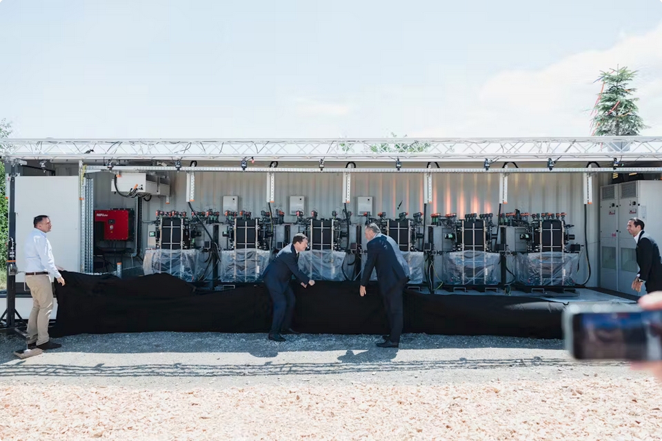

Die [CMBlu Energy AG](https://www.cmblu.com/de/home/) (ansässig in Alzenau im unterfränkischen Landkreis
Aschaffenburg) hat eine einzigartige (patentierte), organische Feststoff-Flüssig-Batterietechnologie (Organic-Solid-Flow Battery) entwickelt.
Diese hat sehr interessante Eigenschaften und stößt auf großes Interesse.

- Skalierbar: Leistung und Kapazität können unabhängig voneinander angepasst werden.
- Nachhaltig: Herstellung ohne seltene oder konfliktbehaftete Rohstoffe.
- Sicher: Frei von brennbaren oder explosiven Materialien.
- Langlebig: Regenerierbare organische Elektrolyte sorgen für eine sehr lange Lebensdauer.
- Recyclebar: Materialien können vollständig wiederverwertet werden.

Einsatzbereiche der Technologie sind unter anderem:

- [erneuerbare Energien](https://www.cmblu.com/de/energiespeicherloesungen/erneuerbare-energien/)
- [E-Mobilität](https://www.cmblu.com/de/energiespeicherloesungen/ladeinfrastruktur/)
- [Industrie und Gewerbe](https://www.cmblu.com/de/energiespeicherloesungen/industriestandorte/)
- [Übertragungs- und Verteilnetze](https://www.cmblu.com/de/energiespeicherloesungen/uebertragungsnetze-verteilnetze/)

In einigen Projekten wird die Technologie bereits eingesetzt:

- [Die Mercedes-Benz Group AG hat 2024 einen 11MWh großen Stromspeicher für das Werk Rastatt bestellt.](https://www.cmblu.com/de/press-and-media/mercedes-benz-batterieprojekt-rastatt/)
- [2023 wurde ein Stromspeicher an einen großen Solarpark in den USA (Arizone, Phoenix) ausgeliefert.](https://www.cmblu.com/de/press-and-media/srp-cmblu-desert-blume-langzeitspeicher-solarpark/)
- [2023 wurde ein Stromspeicher an einen hybriden Solar- und Windpark in Östereich (Burgenland, Schattendorf) ausgeliefert.](https://www.cmblu.com/de/press-and-media/weltpremiere-solidflow-batterie-ausgeliefert/)
- [2023 wird ein Projekt zur Transformation des Uniper-Kraftwerks Staudinger (Frankfurt) vorgestellt.](https://www.cmblu.com/de/press-and-media/uniblu-uniper-cmblu-pilotprojekt-transformation/)
- [Das Burgenland (Österreich) hat 2022 einen 300MWh großen Stromspeicher bestellt der die Region als erste der Welt bis 2030 energieautark (Strom) und klimaneutral machen soll.](https://www.cmblu.com/de/press-and-media/neuartige-grossspeicher/)

Weitere Information zur [Geschichte](https://www.cmblu.com/de/ueber-uns/) und
[gewonnenen Innovationspreisen und Investoren (wie der STRABAG AG)](https://www.cmblu.com/de/press-and-media/).
