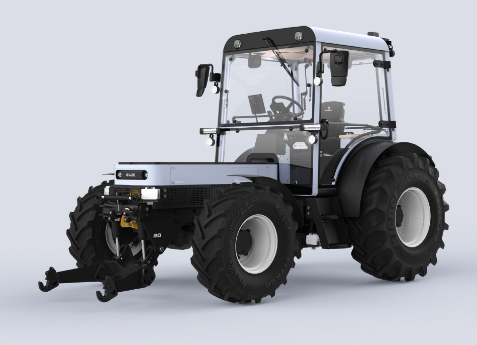

# In Brief

Ein bedeutender Teil der landwirtschaftlichen Betriebe erzeugt Strom mithilfe
von PV- oder Biogasanlagen, kann diesen jedoch weder effektiv nutzen noch
gewinnbringend ins Netz einspeisen. ONOX bietet eine Lösung zur Nutzung
und Speicherung selbst erzeugten Stroms, indem Batteriemodule sowohl als
Speicher als auch als austauschbare Batterien für den ONOX-Traktor dienen.
Das ONOX Energy-Ecosystem ermöglicht es landwirtschaftlichen Betrieben,
dank seiner austauschbaren Batterien völlig autark und unabhängig von
schwankenden Dieselpreisen zu arbeiten, und das ohne Ausfallzeiten beim
Aufladen.

# Innovativer Charakter

In der Landwirtschaft herrscht hohe Planungsunsicherheit und Abhängigkeit
durch schwankende Dieselpreise und Verkaufspreise von Strom für
Eigenerzeuger. Energiespeicher sind nicht vielseitig genug und Elektrotraktoren
aufgrund ihres hohen Energiebedarfs und fehlender Schnelllademöglichkeiten
in ihrer Einsatzdauer begrenzt, was die hohen Investitionskosten oft nicht
rechtfertigt.
Das ONOX Energy-Ecosystem ermöglicht es landwirtschaftlichen Betrieben,
dank seiner austauschbaren Batterien völlig autark und unabhängig von
schwankenden Dieselpreisen zu arbeiten, und das ohne Ausfallzeiten beim
Aufladen an sonst üblichen Ladesäulen. Die Batterien werden außerhalb des
Fahrzeugs langsam und schonend geladen. Dies erhöht die
Batterielebensdauer und schont das Stromnetz. Durch eine dauerhafte
Verbindung der Batterien mit dem Stromnetz beim Laden, können Vehicle-to-
Grid (V2G)-Anwendungen, Energie mit dem Netz austauschen, während der
andere Teil der Batterien am Traktor im Einsatz ist. Diese Art von
Elektromobilität stellt daher kein Stresspotenzial für das Deutsche Stromnetz
dar, sondern kann sogar dazu dienen das Netz zu stabilisieren, indem Angebot
und Nachfrage ausgeglichen werden.

# Status Quo

Landwirtschaftliche Betriebe stellen ein Umfeld mit vielen ungenutzten
Möglichkeiten dar, welche deutlich über die alleinige Lebensmittelproduktion
hinausgehen. Sie bieten großes Potential zur lokalen Energieerzeugung und
Verwaltung. Stattdessen müssen viele Betriebe ihre PV-Anlagen zu
Spitzenzeiten abstellen um das Netz nicht zu überlasten, können die erzeugte
Energie nicht sinnvoll selber nutzen oder speichern und bleiben weiterhin
abhängig von schwankenden Diesel und Strompreisen. Eine Abhängigkeit, die
Planung schwierig macht.
Der Traktor-Markt wird nach wie vor von Dieselbetriebenen Fahrzeugen
dominiert. Die Elektrifizierung schreitet vergleichsweise langsam voran,
aufgrund der Anforderungen an landwirtschaftliche Fahrzeuge. Traktoren haben
einen hohen Energiebedarf und lange Nutzungszeiten, was große Batterien
erfordert und eine entsprechende Ladeinfrastruktur, die noch nicht existiert.
Außerdem stellen hohe Investitionskosten eine Hürde dar. Das Potential ist
allerdings groß, da die von Diesel-Traktoren verursachten Emissionen und
Lärmbelastungen hoch sind und nicht nur ein Problem für die Umwelt sondern
auch für die eigene Gesundheit und das Tierwohl darstellen - besonders in
Ställen, Scheunen und Gewächshäusern. Zudem sind Diesel-Traktoren deutlich
ineffizienter und erfordern mehr Wartung.

# Vorteile für den Betrieb und Nutzer*in

Umweltfreundlich und emissionsfrei trägt das ONOX-Energy-Ecosystem
maßgeblich zur Reduktion des CO2-Ausstoßes eines Betriebes bei und mindert
die Abhängigkeit von fossilen Brennstoffen. Der Einsatz von selbstproduzierter
Energie reduziert den Bedarf an externen Energiequellen, stabilisiert den
Energiehaushalt des Betriebs und fördert die Nutzung erneuerbarer Energien.
Die Kosten für Energie aus eigenen Quellen sind deutlich niedriger als die für
Diesel oder andere zugekaufte Energie, was erhebliche Einsparungen bei
Betriebskosten ermöglicht. Die modulare Batterietechnologie ermöglicht eine
nahtlose Integration in bestehende Energiesysteme und erlaubt flexible
Einsatzzeiten durch schnelles Wechseln der Batterien. Dies maximiert die
Betriebszeiten und Effizienz der landwirtschaftlichen Maschinen.
Der elektrische Traktor erzeugt keinerlei Abgase, weniger Vibrationen und ist
deutlicher leiser, wodurch er eine deutliche Verbesserung in der
Arbeitssicherheit darstellt, die Arbeit an sich erleichtert und die Gesundheit der
Arbeitenden schont. Die einfache Handhabung und Wartung des elektrischen
Niedervolt-Systems reduziert zudem das Risiko von Arbeitsunfällen, vereinfacht
den Betrieb und führt zu einer erhöhten Produktivität.

# Durchführbarkeit

Die Einführung eines solchen Systems stellt einige Herausforderungen wie
hohe Investitionskosten, sich schnell verändernde Batterietechnologien und ein
gut funktionierendes Energie-Management-System dar. In den nächsten 5-10
Jahren werden technologische Fortschritte, erweiterte Ladeinfrastrukturen und
Förderungen, die Machbarkeit und den Erfolg dieses Systems aber weiter
unterstützen.

# ONOX gemessen an UN - Sustainable Development goals

Das ONOX-Energy-Ecosystem stellt eine bedeutende Gelegenheit dar, eine
zentrale Rolle bei der Förderung erneuerbarer Energien zu spielen,
insbesondere in ländlichen Gebieten und potenziell auch in ärmeren Regionen
im Zuge der weiteren Entwicklung. Landwirtschaftliche Betriebe bieten hierfür
ideale Bedingungen. Darüber hinaus zielt die Entwicklung eines kreislauffähigen
und langlebigen Traktors darauf ab, nachhaltige Konsum- und
Produktionspraktiken zu fördern.

# Datenblatt

Aktuelle, technische Daten zum ONOX-Traktor ONOX-1 finden Sie auf der
Projektwebsite [ONOX](https://www.onox.de/de/).
